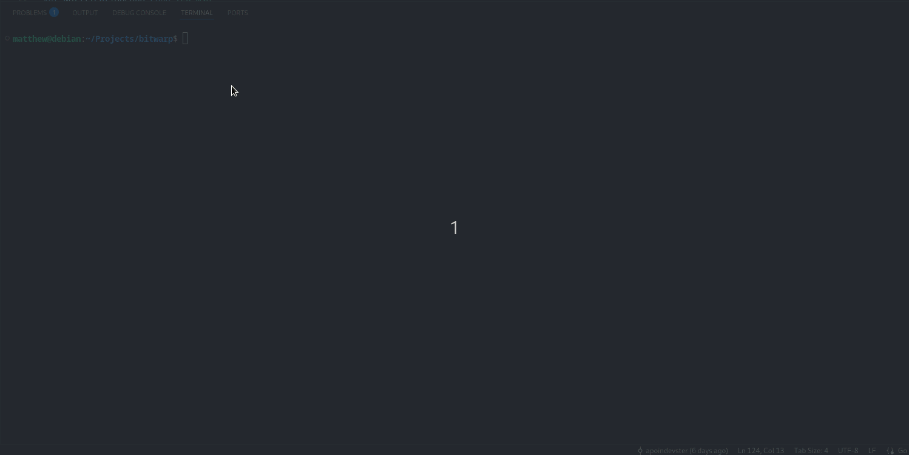

# WARNING
Bitwarp is currently in the prototype phase and does not promise backwards compatibility. BitWarp currently also does not have any releases. If you would like to build BitWarp for your platform, see the building and installation steps below.

# Basic Input Terminal With Ample Remote Procedures (BitWarp)
Bitwarp is designed as a basic command execution server/client designed to explore the capabilities of grpc, charm tooling (bubbletea, bubbles, etc), and aim to solve the issue of remote administration in a simple manner.

# Installation
In order to understand installation, the following description details the various directories in the BitWarp repository:

1. commandclient
    - Commandclient is a go module designed to make an easy to use module interface when talking with the server. This is most of the business logic behind the command execution from a client perspective. It was designed as a module so that future client interfaces, other than the TUI in the ui directory, can be built with relative ease but still talk to the server.
2. commandserver
    - Commandserver is a go module designed to make an easy to use module interface for implementing BitWarp servers. This is most of the business logic behind the command execution from a server perspective. It was designed as a module so that future server interfaces, other than that built in the server directory, can be built with relative ease.
3. proto
    - This directory holds the generated protobuf/grpc library used for all communcations between commandclient and commandserver. The .proto file that generated this library can be found in the root of the repository under `commands.proto`
4. server
    - This directory holds the implementation of the BitWarp server. It implements and utilizes the commandserver module to accomplish this and starts a listening port for a commandclient to talk with.
5. ui
    - This directory holds all of the ui implementation for BitWarp. It utilizes and explores the charm suite of TUI tools (bubbletea, bubbles, etc.)

In each of the previous directories, you will need to make sure the module dependencies are installed. This includes running `go mod tidy` in all but the `proto` directory.

Once completed, you should be able to do the following to run BitWarp

### Running the server
From the server directory, run `go run .` if you want to run from source. Otherwise, if you want to build a binary, run `go build .`. Currently, there are no command line flags to the BitWarp server. Therefore, if you would like to listen on a different port, you will need to modify `main.go` in the server directory.

### Running the client ui
From the ui directory, run `go run .` if you want to run from source. Otherwise, if you want to build a binary, run `go build .`. The bubbletea ui in this directory mainly serves as a marshalling interface state machine to sub-pages located in the `ui/connlist`, `ui/newconn`, `ui/shell` subdirectories.

# Usage
The following is an example of BitWarp ui being used. It assumes that the BitWarp server is already running. Most of the help for the ui should be displayed at the bottom of the ui with the exception of running commands when you interact with a connection. To do this, prepend any command you want to run on the server with `exec`. To navigate to a previous screen, use the `escape` key.

